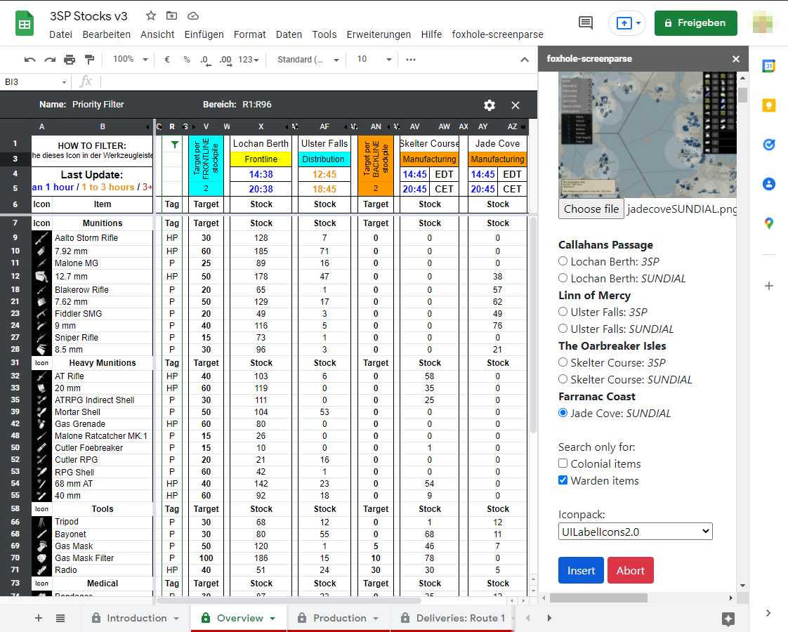
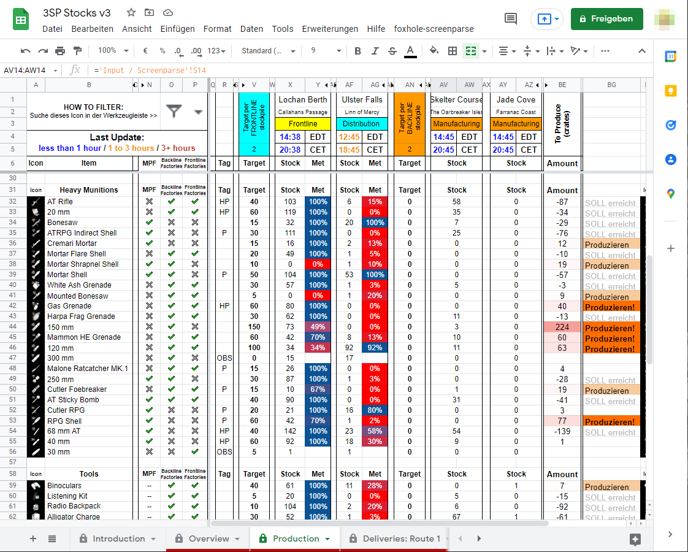

# foxhole-screenparse

Foxhole-screenparse reads contents of stockpile screenshots to ease logistics planning. 
To calculate valuable information from the stockpile data, foxhole-screeparse is integrated into the [Stocks v3](https://docs.google.com/spreadsheets/d/1T9Pj0pXs8YB6OcQXIzCX9XTqG1nJyWauN5D7tfH2lPs/edit?usp=sharing) Google Spreadsheet ([copy sheet](https://docs.google.com/spreadsheets/d/1T9Pj0pXs8YB6OcQXIzCX9XTqG1nJyWauN5D7tfH2lPs/copy)). 
Note that the screenparser sidebar only works when logged in. 

More screenshots

  
  

Foxhole-screenparse is also available as a [standalone website](https://pogobanane.de/foxhole-screenparse/) with a simple table output.

# Technical Overview

Foxhole-screenparse parses contents of stockpiles into machine-readable lists.
It uses a naive image processing approach using openCVs template matching and tesseract for OCR/text recognition. 
Both of those libraries run directly in your browser using wasm and thelike. 

|                                | screenparse           | [Stockpiler](https://github.com/tehruttiger/Stockpiler)   |
|--------------------------------|-----------------------|----------------------|
| platform                       | browser based         | windows app          |
| Seaports/Storage Depots        | yes                   | yes                  |
| Bunker Bases etc.              | partially             | yes                  |
| Supports different resolutions | 1080p - 4k            | manual work required |
| Supports modded item icons     | some                  | manual work required |
| imaging tech                   | openCV, tesseract OCR | openCV               |
| language                       | js                    | py                   |

# Build / Deploy

This repo contains two sub-projects: A standalone statically served website (`./index.html`) and a google spreadsheets sidebar (`./apps-script/`).

## Standalone Website

Clone this repository with all submodules: `git clone --recurse-submodules [repourl]`

Pull to fetch updates: `git pull && git submodule update`

Run a debugging server: `make debug`

The webpage has no backend, so just shove the files into some webroot or so which has its files statically served (i.e. `make install`).

## Google Spreadsheet Sidebar

Use `make appsscript` to package the files (`./apps-script/build`). Those files will be pushed to google via googles `clasp`. You can just as well copy and paste the build files to the `Apps Script` area of your spreadsheet to incorporate the sidebar, for example if you don't have clasp installed.

# Conribute

This project can use some work on the front-end. The frontend could be set up with proper compilation steps (react).

While the output table is built to be exported into spreadsheets, the relevant spreadsheet functionality could directly be built into the website.

